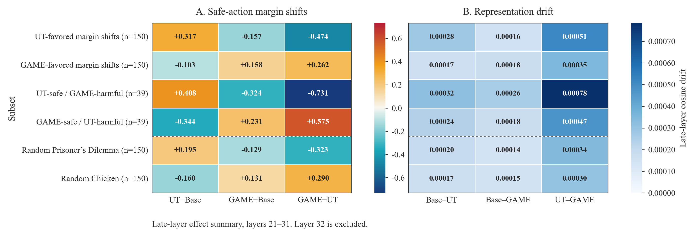

# moral-mechinterp

`moral-mechinterp` is a reproducible research repo for behavioral and early mechanistic analysis on the GT-HarmBench two-choice moral/game-theoretic dataset. The central result so far is:

> Aggregate safe-choice rates are flat, but UT and GAME adapters create objective-specific late-layer safe-action margin shifts. These shifts are structured by strategic regime and occur with very small cosine representation drift, suggesting small readout-aligned perturbations rather than broad representation rewrites.

This is not a claim that moral RL improves aggregate alignment or that we have found moral circuits. The current evidence is diagnostic: adapter training reshapes late-layer decision evidence without producing strong binary safety gains.

## Setup

```bash
uv sync
```

The evaluated models are:

| Key | Model |
|---|---|
| Base | `unsloth/Qwen3.5-9B` |
| UT | `agentic-moral-alignment/qwen35-9b__gtharm_pd_str_tft__gtharm_ut__native_tool__r1__gtharm_pd` |
| GAME | `agentic-moral-alignment/qwen35-9b__gtharm_pd_str_tft__gtharm_game__native_tool__r1__gtharm_pd` |

UT and GAME are PEFT/LoRA adapter repos; the loader supports both full CausalLM checkpoints and PEFT adapters.

## Behavioral Anchor

Prompts are deterministic A/B decisions ending in `Answer:`. The evaluator scores next-token logits for `" A"` and `" B"` and defines:

`safe margin = logit(safe option) - logit(harmful option)`

Positive margins mean the model prefers the safe/cooperative action; negative margins mean it prefers the harmful/defective action. Logit scoring avoids free-form parsing ambiguity and gives a continuous decision variable for later mechanistic work.

Behavioral evaluation on the position-balanced GT-HarmBench dataset:

| Model | Safe rate | Mean safe margin | Median safe margin | n |
|---|---:|---:|---:|---:|
| Base | 0.702 | 0.644 | 0.625 | 3185 |
| UT | 0.701 | 0.658 | 0.750 | 3185 |
| GAME | 0.701 | 0.631 | 0.625 | 3185 |

Paired safe-rate changes relative to Base are effectively zero: UT − Base = −0.00094, GAME − Base = −0.00094, with bootstrap confidence intervals crossing zero.

Primary outputs:

- `outputs/behavior_full/model_choices.csv`
- `outputs/behavior_full/model_choices.jsonl`
- `outputs/tables_full/overall_metrics.csv`
- `outputs/tables_full/paired_improvements.csv`

## Mechanistic Findings

Layerwise logit lens projects the final prompt-token residual stream at each layer through the final norm and LM head. Layer 0 is the embedding output; layer 32 recovers the final behavioral A/B margin. Late-layer summaries average layers 21-31, excluding layer 32.

Adapter-delta logit lens subtracts the Base safe-margin trajectory from each adapter trajectory:

- `UT − Base`: utilitarian adapter-induced safe-margin shift.
- `GAME − Base`: game-theoretic adapter-induced safe-margin shift.
- `GAME − UT`: relative GAME-vs-UT adapter shift.

Representation drift compares final prompt-token hidden states with pairwise cosine drift.

Activation patching tests causality directly by copying each source example's final-token residual state into the matched target forward pass. The patching convention is explicit: layer 0 is the embedding output, layers 1..L are transformer block outputs, and layer L+1 is the final-norm readout site. For the 32-block Qwen model, layer 32 is the last block output and layer 33 is final norm. The final-norm site is reported as a sanity check, not as a transformer-layer effect. This is not an averaged direction-vector intervention; future direction-vector tests should estimate directions on one split, test on held-out examples, and sweep the intervention scale.

| Subset | n | UT−Base margin | GAME−Base margin | GAME−UT margin | Base–UT drift | Base–GAME drift | UT–GAME drift |
|---|---:|---:|---:|---:|---:|---:|---:|
| UT-favored margin shifts | 150 | +0.317 | -0.157 | -0.474 | 0.00028 | 0.00016 | 0.00051 |
| GAME-favored margin shifts | 150 | -0.103 | +0.158 | +0.262 | 0.00017 | 0.00018 | 0.00035 |
| UT-safe / GAME-harmful | 39 | +0.408 | -0.324 | -0.731 | 0.00032 | 0.00026 | 0.00078 |
| GAME-safe / UT-harmful | 39 | -0.344 | +0.231 | +0.575 | 0.00024 | 0.00018 | 0.00047 |
| Random Prisoner's Dilemma | 150 | +0.195 | -0.129 | -0.323 | 0.00020 | 0.00014 | 0.00034 |
| Random Chicken | 150 | -0.160 | +0.131 | +0.290 | 0.00017 | 0.00015 | 0.00030 |

Interpretation:

- UT increases late-layer safe-action evidence on UT-favored and Prisoner's Dilemma-heavy subsets.
- GAME increases late-layer safe-action evidence on GAME-favored and Chicken-heavy subsets.
- The random PD/Chicken controls show the same directional pattern, so the effect is not only a top-shift selection artifact.
- Cosine representation drift stays tiny, around `1e-4` to `8e-4`, even when adapter-delta margins are large.

Main figures:

- `outputs/figures_logit_lens/logit_lens_combined_2x2.png`
- `outputs/figures_adapter_delta/adapter_delta_logit_lens_2x3.png`
- `outputs/figures_adapter_delta/adapter_delta_logit_lens_heatmap.png`
- `outputs/figures_adapter_delta/late_layer_effect_summary_heatmap.png`
- `outputs/figures_repdrift/*_cosine_drift.png`



## Experiments

| Stage | Script | Purpose |
|---|---|---|
| Data conversion | `scripts/convert_gtharmbench_csv.py` | Convert original GT-HarmBench CSV/XLSX to JSONL. |
| Position balancing | `scripts/balance_ab_positions.py` | Randomize A/B positions to avoid safe-label imbalance. |
| Behavioral eval | `scripts/evaluate_behavior.py` or `moral-eval` | Score A/B logits and build disagreement sets. |
| Behavioral summary | `scripts/summarize_behavior.py` or `moral-summary` | Tables, safe rates, bootstrap paired improvements, subset CSVs. |
| Logit lens | `scripts/03_logit_lens_margins.py` | Layerwise safe-action margin trajectories. |
| Paper figures | `scripts/04_make_paper_figures.py` | Combined 2x2 logit-lens figure and late-layer tables. |
| Random controls | `scripts/04_make_random_control_subsets.py`, `scripts/05_summarize_control_logit_lens.py` | Random PD/Chicken controls. |
| Representation drift | `scripts/06_representation_drift.py`, `scripts/07_summarize_representation_drift.py` | Pairwise layerwise cosine drift. |
| Adapter deltas | `scripts/08_plot_adapter_delta_logit_lens.py`, `scripts/09_plot_adapter_delta_heatmap.py` | Base-subtracted adapter effects. |
| Effect summary | `scripts/10_plot_late_layer_effect_summary_heatmap.py` | Compact late-layer margin + drift heatmap. |
| Activation patching | `scripts/run_activation_patching.py` | Causal final-token residual patching between Base and adapters. |

## Reproduction

Run behavioral evaluation:

```bash
PYTHONPATH=src python -m moral_mechinterp.cli.evaluate_behavior \
  data/gtharmbench_balanced.jsonl \
  --config configs/eval.yaml \
  --output-dir outputs/behavior_full
```

Summarize behavior:

```bash
PYTHONPATH=src python -m moral_mechinterp.cli.summarize_behavior \
  outputs/behavior_full/model_choices.csv \
  --config configs/eval.yaml \
  --tables-dir outputs/tables_full \
  --figures-dir outputs/figures_full
```

Run logit lens on the main subsets:

```bash
PYTHONPATH=src python scripts/03_logit_lens_margins.py \
  --subset-csv outputs/behavior_full/subsets/top_ut_margin_shift.csv \
  --config configs/eval.yaml \
  --output-dir outputs/logit_lens_fixed/top_ut_margin_shift \
  --models base,ut,game
```

Repeat for:

- `top_game_margin_shift`
- `ut_safe_game_harmful`
- `game_safe_ut_harmful`
- `random_pd_150`
- `random_chicken_150`

Regenerate tables and figures from saved outputs:

```bash
PYTHONPATH=src python scripts/04_make_paper_figures.py
PYTHONPATH=src python scripts/05_summarize_control_logit_lens.py
PYTHONPATH=src python scripts/07_summarize_representation_drift.py
PYTHONPATH=src python scripts/08_plot_adapter_delta_logit_lens.py
PYTHONPATH=src python scripts/09_plot_adapter_delta_heatmap.py
PYTHONPATH=src python scripts/10_plot_late_layer_effect_summary_heatmap.py
```

Before a full activation patching run, run the hook sanity check. It uses a few examples, enables null patch controls, and verifies that layer 0 has near-zero effect while the final-norm readout site recovers the source margins:

```bash
PYTHONPATH=src python scripts/run_activation_patching.py \
  --sanity-check \
  --config configs/eval.yaml \
  --data-jsonl data/gtharmbench_balanced.jsonl \
  --output-dir artifacts/patching_sanity \
  --no-plot
```

Run activation patching on the default priority subsets:

```bash
PYTHONPATH=src python scripts/run_activation_patching.py \
  --config configs/eval.yaml \
  --data-jsonl data/gtharmbench_balanced.jsonl \
  --output-dir artifacts/patching \
  --include-null-controls
```

## Compute Notes

The models are 9B-scale. A100 40GB/80GB, L40S, or H100 GPUs are recommended. Inference scripts load one model at a time to reduce VRAM pressure. Use `batch_size=1` for robust runs, then increase only after validating memory.
