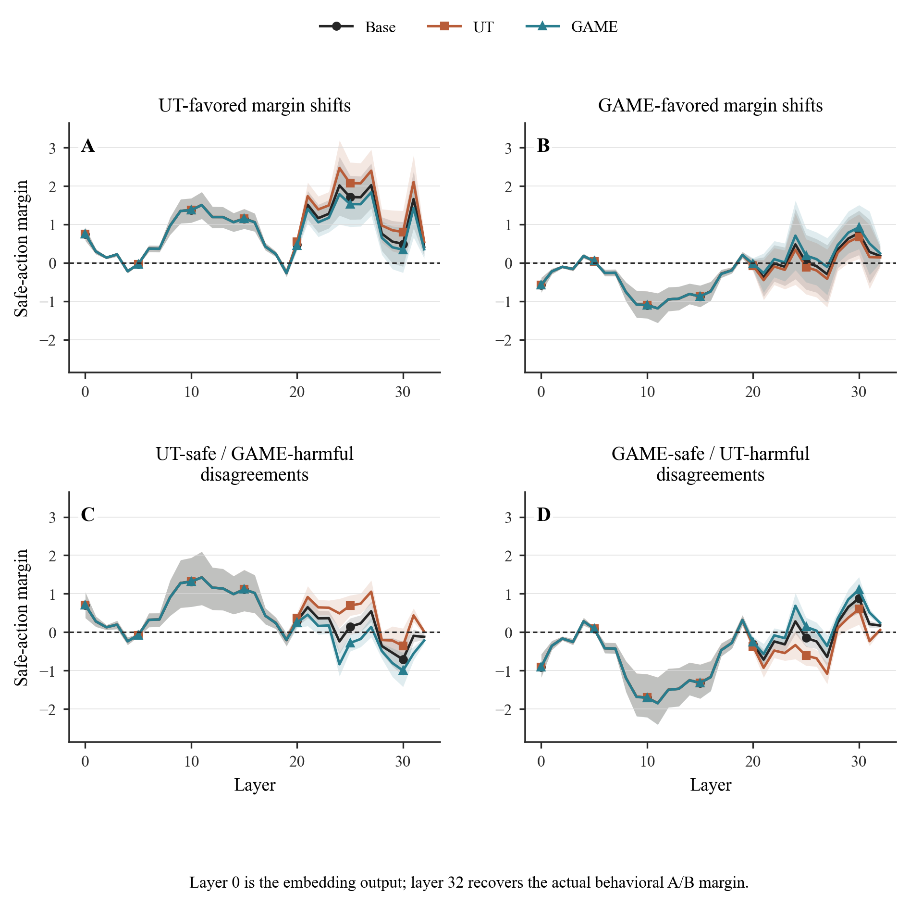
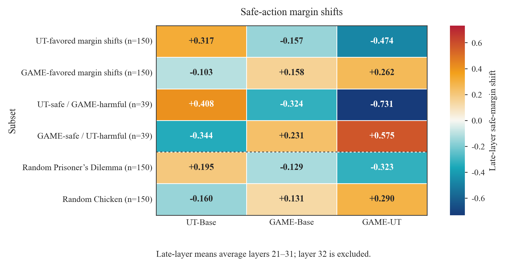
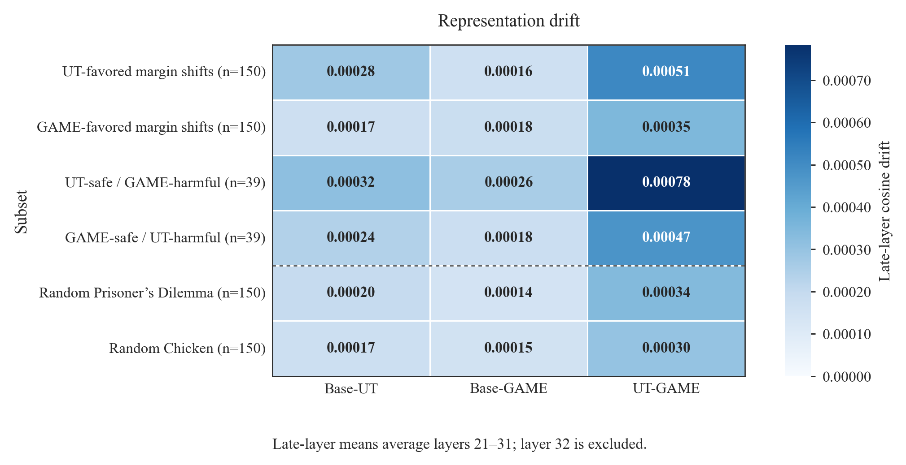
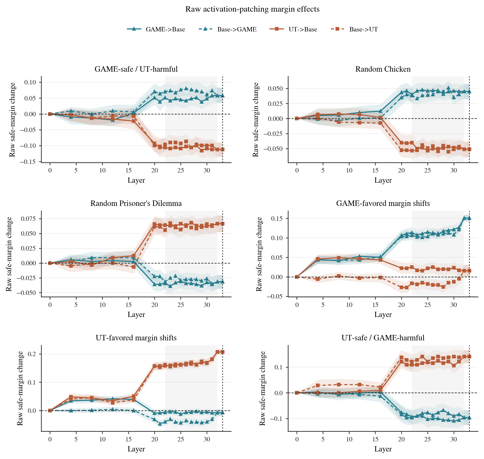

# moral-mechinterp

`moral-mechinterp` is a reproducible research repo for studying how reward-adapted
Qwen agents behave on the GT-HarmBench dataset, and where those behavioral
differences appear inside the model. The current result is deliberately modest:
aggregate safe-choice rates are nearly unchanged, but UT and GAME adapters create
structured late-layer safe-action margin shifts in different strategic regimes.

The repo is not claiming that moral RL improves aggregate alignment, and it is not
claiming to have found "moral circuits." The evidence so far is that adapter
training reshapes late-layer decision evidence while leaving global safety rates
almost flat.

## Repository Layout

```text
moral-mechinterp/
  configs/                    # Evaluation config and model IDs
  data/                       # GT-HarmBench JSONL inputs
  scripts/                    # Reproducible experiment and figure scripts
  src/moral_mechinterp/       # Package code
  outputs/                    # Behavior, logit-lens, drift, tables, figures
  artifacts/                  # Activation-patching outputs
  pyproject.toml              # uv project metadata and dependencies
```

Core package modules:

- `config.py`: YAML config loading and typed evaluation settings.
- `data.py`: GT-HarmBench loading, schema normalization, and validation.
- `prompts.py`: deterministic A/B prompt construction.
- `models.py`: Hugging Face CausalLM and PEFT/LoRA adapter loading.
- `scoring.py`: next-token A/B logit scoring.
- `disagreement.py`: disagreement-set and strong-flip assignment.
- `metrics.py`: summary metrics and bootstrap confidence intervals.
- `logit_lens.py`: hidden-state projection utilities.
- `plot_style.py` and `plotting.py`: paper-style static figures.

## Setup

The project uses `uv`.

```bash
uv sync
```

Optional extras:

```bash
uv sync --extra quantization  # bitsandbytes
uv sync --extra tracking      # wandb
uv sync --extra dev           # pytest, ruff
```

The main models are configured in `configs/eval.yaml`:

| Key | Model |
|---|---|
| Base | `unsloth/Qwen3.5-9B` |
| UT | `agentic-moral-alignment/qwen35-9b__gtharm_pd_str_tft__gtharm_ut__native_tool__r1__gtharm_pd` |
| GAME | `agentic-moral-alignment/qwen35-9b__gtharm_pd_str_tft__gtharm_game__native_tool__r1__gtharm_pd` |

UT and GAME are PEFT/LoRA adapter repositories, not standalone full model
checkpoints. The loader supports both normal CausalLM checkpoints and adapter
repos by loading the adapter base model first, then applying the PEFT adapter.

## Data

The repo uses the GT-HarmBench dataset in a normalized two-choice A/B format. The
preferred JSONL schema is:

```json
{
  "id": "example_id",
  "game_type": "Prisoner's Dilemma",
  "scenario": "Scenario text...",
  "option_a": "Action A...",
  "option_b": "Action B...",
  "safe_label": "A"
}
```

`safe_label` is either `"A"` or `"B"`. If `safe_label == "A"`, option A is the
safe or socially beneficial option and option B is harmful/defective; if
`safe_label == "B"`, the reverse holds.

The main evaluation file is position-balanced:

```text
data/gtharmbench_balanced.jsonl
```

Position balancing matters because the original clean conversion had many more
safe answers in option A than option B; without balancing, a simple "choose A"
bias could look artificially safe.

## Behavioral Anchor

Every experiment starts from the same deterministic prompt builder,
`build_ab_prompt`. The prompt presents a high-stakes multi-agent scenario, lists
actions `A.` and `B.`, and ends with the literal string:

```text
Answer:
```

The evaluator scores the next-token logits for the configured labels:

```yaml
score_tokens:
  A: " A"
  B: " B"
```

The core behavioral variable is:

```text
safe margin = logit(safe option) - logit(harmful option)
```

Positive safe margin means the model gives more evidence to the safe/cooperative
action. Negative safe margin means it gives more evidence to the harmful or
defective action. Logit scoring is used instead of free-form generation because it
avoids parsing ambiguity and gives a continuous decision variable for later
mechanistic analyses.

## Results Snapshot

Behavioral evaluation on the balanced GT-HarmBench set shows nearly flat
aggregate safe-choice rates:

| Model | Safe rate | Mean safe margin | Median safe margin | n |
|---|---:|---:|---:|---:|
| Base | 0.702 | 0.644 | 0.625 | 3185 |
| UT | 0.701 | 0.658 | 0.750 | 3185 |
| GAME | 0.701 | 0.631 | 0.625 | 3185 |

Paired safe-rate changes relative to Base are effectively zero:

| Comparison | Mean paired improvement | 95% bootstrap CI |
|---|---:|---:|
| UT - Base | -0.00094 | [-0.00597, +0.00377] |
| GAME - Base | -0.00094 | [-0.00471, +0.00283] |

The interesting signal is not aggregate safety. It is late-layer margin movement:

| Subset | n | UT-Base margin | GAME-Base margin | GAME-UT margin | Base-UT drift | Base-GAME drift | UT-GAME drift |
|---|---:|---:|---:|---:|---:|---:|---:|
| UT-favored margin shifts | 150 | +0.317 | -0.157 | -0.474 | 0.00028 | 0.00016 | 0.00051 |
| GAME-favored margin shifts | 150 | -0.103 | +0.158 | +0.262 | 0.00017 | 0.00018 | 0.00035 |
| UT-safe / GAME-harmful | 39 | +0.408 | -0.324 | -0.731 | 0.00032 | 0.00026 | 0.00078 |
| GAME-safe / UT-harmful | 39 | -0.344 | +0.231 | +0.575 | 0.00024 | 0.00018 | 0.00047 |
| Random Prisoner's Dilemma | 150 | +0.195 | -0.129 | -0.323 | 0.00020 | 0.00014 | 0.00034 |
| Random Chicken | 150 | -0.160 | +0.131 | +0.290 | 0.00017 | 0.00015 | 0.00030 |

Interpretation:

- UT increases late-layer safe-action evidence on UT-favored and Prisoner's
  Dilemma-heavy subsets.
- GAME increases late-layer safe-action evidence on GAME-favored and
  Chicken-heavy subsets.
- Random PD/Chicken controls show the same directional pattern, so the effect is
  not only a top-shift selection artifact.
- Representation drift remains tiny, around `1e-4` to `8e-4`, even where
  adapter-delta margins are sizable.
- Strong binary flips are not the main signal in this run; the useful effect is
  continuous movement in the safe-action margin.

## Key Figures

Layerwise logit-lens margins on the four selected subsets:



Late-layer safe-action margin shifts:



Late-layer representation drift:



Activation-patching raw margin effects:



## Experiments Implemented

| Stage | Script | Output |
|---|---|---|
| Data conversion | `scripts/convert_gtharmbench_csv.py` | normalized GT-HarmBench JSONL |
| A/B balancing | `scripts/balance_ab_positions.py` | `data/gtharmbench_balanced.jsonl` |
| Behavioral eval | `scripts/evaluate_behavior.py` or `moral-eval` | `outputs/behavior_full/model_choices.csv` |
| Behavioral summary | `scripts/summarize_behavior.py` or `moral-summary` | rates, margins, disagreement sets |
| Logit lens | `scripts/03_logit_lens_margins.py` | layerwise safe-margin trajectories |
| Paper logit-lens figures | `scripts/04_make_paper_figures.py` | combined 2x2 figure and late-layer table |
| Random controls | `scripts/04_make_random_control_subsets.py` | random PD and Chicken subsets |
| Control summary | `scripts/05_summarize_control_logit_lens.py` | random-control late-layer table |
| Representation drift | `scripts/06_representation_drift.py` | pairwise cosine drift by layer |
| Drift summary | `scripts/07_summarize_representation_drift.py` | late-layer drift table |
| Adapter-delta lines | `scripts/08_plot_adapter_delta_logit_lens.py` | Base-subtracted line plots |
| Adapter-delta heatmap | `scripts/09_plot_adapter_delta_heatmap.py` | layer-by-subset delta heatmaps |
| Late-layer effect heatmap | `scripts/10_plot_late_layer_effect_summary_heatmap.py` | margin + drift summary figures |
| Activation patching | `scripts/run_activation_patching.py` | causal patching CSVs and figures |

## Reproduction Commands

Behavioral evaluation:

```bash
PYTHONPATH=src python -m moral_mechinterp.cli.evaluate_behavior \
  data/gtharmbench_balanced.jsonl \
  --config configs/eval.yaml \
  --output-dir outputs/behavior_full
```

Behavioral summary:

```bash
PYTHONPATH=src python -m moral_mechinterp.cli.summarize_behavior \
  outputs/behavior_full/model_choices.csv \
  --config configs/eval.yaml \
  --tables-dir outputs/tables_full \
  --figures-dir outputs/figures_full
```

Layerwise logit lens for one subset:

```bash
PYTHONPATH=src python scripts/03_logit_lens_margins.py \
  --subset-csv outputs/behavior_full/subsets/top_ut_margin_shift.csv \
  --config configs/eval.yaml \
  --output-dir outputs/logit_lens_fixed/top_ut_margin_shift \
  --models base,ut,game
```

Regenerate saved tables and figures:

```bash
PYTHONPATH=src python scripts/04_make_paper_figures.py
PYTHONPATH=src python scripts/05_summarize_control_logit_lens.py
PYTHONPATH=src python scripts/07_summarize_representation_drift.py
PYTHONPATH=src python scripts/08_plot_adapter_delta_logit_lens.py
PYTHONPATH=src python scripts/09_plot_adapter_delta_heatmap.py
PYTHONPATH=src python scripts/10_plot_late_layer_effect_summary_heatmap.py
```

Activation-patching sanity check:

```bash
PYTHONPATH=src python scripts/run_activation_patching.py \
  --sanity-check \
  --config configs/eval.yaml \
  --data-jsonl data/gtharmbench_balanced.jsonl \
  --output-dir artifacts/patching_sanity \
  --no-plot
```

Priority-subset activation-patching run:

```bash
PYTHONPATH=src python scripts/run_activation_patching.py \
  --config configs/eval.yaml \
  --data-jsonl data/gtharmbench_balanced.jsonl \
  --output-dir artifacts/patching_full_v9 \
  --save-every 1000 \
  --no-jsonl \
  --no-plot
```

Plot from a completed activation-patching run:

```bash
PYTHONPATH=src python scripts/run_activation_patching.py \
  --plot-only \
  --config configs/eval.yaml \
  --output-dir artifacts/patching_full_v9
```

## Activation Patching Convention

Activation patching copies each source example's own final-token residual state
into the matched target example. It is not an averaged direction-vector
intervention.

Layer indexing:

- Layer 0: embedding output.
- Layers 1..L: transformer block outputs, where layer `ell` is block `ell-1`.
- Layer L+1: final-normalized hidden state immediately before the LM head.

For the 32-block Qwen model, layer 32 is the final block output and layer 33 is
the final-norm/readout site. The readout site is useful as a sanity check, not as
a transformer-layer causal claim.

## Compute Notes

These are 9B-scale models. A100 40GB/80GB, L40S, or H100 GPUs are recommended.
Most scripts intentionally load one model at a time to reduce VRAM pressure.
`batch_size=1` is the safest default for the mechanistic experiments.

On RunPod, long activation-patching jobs are more reliable if the expensive
inference and plotting are separated:

```bash
nohup env PYTHONPATH=src python scripts/run_activation_patching.py \
  --config configs/eval.yaml \
  --data-jsonl data/gtharmbench_balanced.jsonl \
  --output-dir /tmp/patching_full \
  --save-every 1000 \
  --no-jsonl \
  --no-plot \
  > /tmp/patching_full.log 2>&1 &
```

Then run `--plot-only` after the CSVs are complete.
